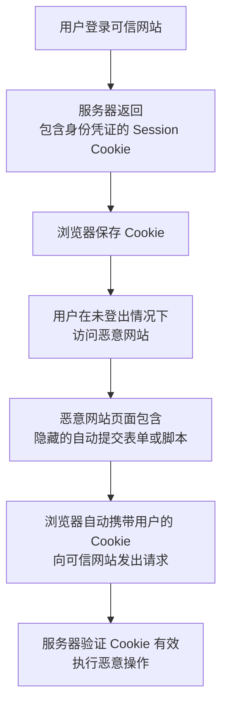

好的，我们用一个通俗易懂的方式来解释 SQL 注入。

### 一句话概括
**SQL 注入就是一种通过巧妙构造输入，来“欺骗”应用程序，使其执行恶意 SQL 代码的攻击技术。** 其核心原因是 **“程序代码”** 和 **“用户数据”** 没有清晰地分离开。

---

### 一个生动的例子

想象一个用户登录的场景：

1.  **正常的登录流程：**
    *   用户在网页上输入用户名 (`user123`) 和密码 (`mypassword`)。
    *   网站后台的应用程序会拼接一条 SQL 查询语句，去数据库里核对信息。
    *   拼接后的 SQL 语句是这样的：
        ```sql
        SELECT * FROM users 
        WHERE username = 'user123' AND password = 'mypassword';
        ```
    *   这句 SQL 的意思是：从 `users` 表中查找用户名为 `'user123'` **并且** 密码为 `'mypassword'` 的记录。如果找到了，就说明登录成功。

2.  **黑客进行 SQL 注入攻击：**
    *   黑客在用户名输入框里，不输入正常的用户名，而是输入一个“神奇”的字符串：`' OR 1=1 -- `
    *   他密码框可以随便输入，比如 `abc`。
    *   现在，应用程序依然傻傻地把用户输入拼接到 SQL 语句里：
        ```sql
        SELECT * FROM users 
        WHERE username = '' OR 1=1 -- ' AND password = 'abc';
        ```
    *   **关键点来了！** 我们来看一下这个被“篡改”的 SQL 语句：
        *   `username = ''`： 这部分是查找空用户名。
        *   `OR`： SQL 中的“或”逻辑。
        *   `1=1`： 这是一个永远为真的条件。
        *   `-- `（注意后面有个空格）： 在 SQL 中，这是单行注释符，它意味着 `--` 之后的所有内容都会被数据库忽略掉。

3.  **最终被执行的 SQL 语句实际上是：**
    ```sql
    SELECT * FROM users 
    WHERE username = '' OR 1=1
    ```
    *   这句 SQL 的意思变成了：从 `users` 表中查找用户名为空 **或者** `1=1`（永远成立） 的记录。
    *   由于 `1=1` 永远成立，这个查询会返回 `users` 表中的 **所有用户记录**！

4.  **攻击结果：**
    *   应用程序看到数据库返回了数据（而不是空结果），就会认为登录“成功”。
    *   黑客很可能就这样绕过了密码验证，直接以第一个用户（通常是管理员）的身份登录了系统。

---

### SQL 注入能造成什么危害？

SQL 注入的危害极其严重，攻击者可以利用它：
*   **绕过身份验证：** 就像上面的例子，无需密码登录他人甚至管理员账户。
*   **窃取敏感数据：** 可以构造 SQL 语句来读取数据库中的任何信息，如用户信息、密码哈希、信用卡号等。
*   **篡改数据：** 可以修改、删除数据库中的数据，造成网站瘫痪或内容被恶意篡改。
*   **提权操作：** 在某些情况下，可以执行数据库管理命令，从而完全控制整个数据库服务器。

---

### 如何防御 SQL 注入？

防御的核心原则就是：**永远不要相信用户的任何输入，并且要将“代码”和“数据”严格分离。**

1.  **使用参数化查询（预编译语句）**
    *   这是最有效、最根本的防御方法。
    *   它的原理是：**先定义好 SQL 语句的骨架（代码）**，然后再将用户输入的数据作为“参数”传递进去。
    *   数据库会非常清楚哪部分是命令，哪部分是数据，即使用户输入里包含了 SQL 代码，数据库也只会把它当作普通的数据来处理，而不会去执行它。
    *   **示例（伪代码）：**
        ```python
        # 定义 SQL 模板，用 ? 或 :name 作为占位符
        sql = "SELECT * FROM users WHERE username = ? AND password = ?"
        
        # 执行查询时，将用户输入作为参数传入
        cursor.execute(sql, (username, password))
        ```
        即使用户名是 `' OR 1=1 --`，数据库也只会去寻找一个用户名为 `' OR 1=1 --` 的用户，而不是把它当作 SQL 命令。

2.  **对输入进行严格的验证和过滤**
    *   对于明确格式的输入（如邮箱、电话号码），进行格式校验。
    *   使用白名单机制，只允许特定的字符通过。
    *   **注意：** 这只是一个辅助手段，不能完全依赖，因为攻击者的绕过手法层出不穷。

3.  **使用ORM框架**
    *   ORM（对象关系映射）框架（如 Hibernate, MyBatis, Django ORM）在底层通常会自动使用参数化查询，从而避免了开发者手动拼接 SQL 字符串。

4.  **最小权限原则**
    *   给应用程序连接数据库的账户分配最小的必要权限。例如，一个只用于查询的页面，就不要给它分配修改、删除数据的权限。这样即使被注入，损失也能降到最低。

### 总结

SQL 注入是一种古老但至今仍非常普遍的严重网络安全漏洞。它利用了程序将用户输入直接作为代码执行的安全缺陷。**防御它的最佳且唯一可靠的方法就是使用参数化查询（预编译语句）**，从根源上杜绝代码与数据的混淆。

好的，我们用一个通俗易懂的方式来解释XSS攻击。

------------------------------------------------------------
------------------------------------------------------------
------------------------------------------------------------

### 一、XSS是什么？

XSS，全称是 **跨站脚本攻击**。这个名称听起来有点复杂，但其实核心很简单：**攻击者想方设法在你的浏览器中执行他们编写的恶意JavaScript代码**。

可以把它想象成：一个坏人成功地把一段“有毒的指令”混进了某个你信任的网站（比如一个论坛、一个评论區），当你的浏览器加载这个网站并显示这条“被污染”的信息时，这条“有毒的指令”就在你的浏览器里悄悄地执行了。

### 二、XSS攻击是如何发生的？

关键在于网站**过于信任用户提交的内容**，并且没有对这些内容进行严格的过滤和转义。

我们来看一个最简单的例子：

假设有一个论坛，用户在评论区留言后，留言会直接显示在网页上。

1.  **正常情况**：用户A留言 `“这篇文章真棒！”`。网页会正常显示这条文字。
2.  **攻击情况**：攻击者B留言，内容不是普通文字，而是一段代码：
    ```html
    <script>alert('你的电脑已被攻击！')</script>
    ```
3.  **问题所在**：如果论坛后台没有对这段留言进行任何处理，直接把它存入数据库并显示给其他用户。那么当用户C访问这个页面时，他的浏览器会看到这段代码，并把它当作正常的网页脚本来执行。结果就是，用户C的页面上会弹出一个警告框，写着“你的电脑已被攻击！”。

当然，弹个窗口只是恶作剧。真正的攻击远比这危险。

### 三、XSS攻击的主要类型

通常分为三类：

1.  **反射型XSS**
    *   **特点**：恶意脚本来自**当前的HTTP请求**。通常诱骗用户点击一个精心构造的链接。
    *   **过程**：
        *   攻击者构造一个包含恶意代码的URL，然后通过邮件、聊天工具等诱骗用户点击。
        *   用户点击后，网站服务器将恶意代码从URL中取出，未经处理就直接嵌入到返回的网页中。
        *   用户的浏览器执行了这个恶意脚本。
    *   **比喻**：就像“反射”，恶意脚本通过一次请求，从URL“反射”到用户的页面上。

2.  **存储型XSS**
    *   **特点**：恶意脚本被**永久地存储**在目标网站的服务器上（如数据库、留言板、评论區）。
    *   **过程**：
        *   攻击者将恶意代码提交到网站（如发表一篇带恶意脚本的博客评论）。
        *   网站服务器将这些代码保存起来。
        *   此后，任何普通用户访问这个页面时，恶意代码都会从服务器被加载并执行。
    *   **危害**：这是最危险的一种，因为它影响所有访问该页面的用户，持续时间长。

3.  **DOM型XSS**
    *   **特点**：漏洞出现在前端JavaScript代码本身，而不是服务器端。恶意脚本的注入和执行完全在浏览器端完成。
    *   **过程**：
        *   网页的JavaScript代码会操作页面的DOM结构。
        *   如果JavaScript代码不安全地使用了来自URL的参数（比如 `document.location.hash`）来更新页面内容，攻击者就可以构造一个特殊的URL。
        *   用户访问这个URL时，页面的JavaScript会读取URL中的恶意部分，并将其写入DOM，导致恶意脚本执行。
    *   **关键**：这种攻击不经过服务器，所以服务器端的防护措施可能无效。

### 四、XSS攻击能造成什么危害？

一旦恶意脚本在你的浏览器中执行，它几乎能冒充你做任何事情：

*   **盗取Cookie**：获取你的登录凭证，从而冒充你登录网站。
*   **发起恶意请求**：冒充你执行各种操作，如发微博、转账、购买商品等。
*   **钓鱼诈骗**：在页面上伪造一个登录框，诱骗你输入用户名和密码。
*   **键盘记录**：记录你在该网页上的所有按键。
*   **盗取敏感信息**：读取你当前页面上显示的个人信息。
*   **破坏页面结构**：篡改网页内容。

### 五、如何防范XSS？

防范的核心原则是：**绝不信任用户提交的任何数据**。

1.  **对输入进行转义和过滤**
    *   在将用户提交的内容显示到页面上之前，对其进行处理。例如，将 `<` 转义为 `&lt;`，将 `>` 转义为 `&gt;`。这样，浏览器就会把它当作普通文本显示，而不是可执行的代码。

2.  **对输出进行编码**
    *   根据数据将要放置的上下文（HTML、JavaScript、CSS、URL），进行相应的编码。

3.  **使用内容安全策略**
    *   **CSP** 是一个重要的安全HTTP头。它告诉浏览器只允许执行来自特定来源的脚本，从根本上杜绝了内联脚本和未经允许的外部脚本的执行。

4.  **设置Cookie的HttpOnly属性**
    *   给Cookie加上 `HttpOnly` 标志，可以防止它被客户端的JavaScript脚本读取，从而有效防止Cookie被盗。

### 总结

**XSS攻击就是攻击者利用网站漏洞，将恶意JavaScript代码注入到网页中，并在其他用户的浏览器上执行，从而实施各种恶意行为。**

**防范的关键在于：永远不要相信用户的输入，在将任何用户提供的内容显示到页面上之前，都必须进行严格的转义和过滤。**

------------------------------------------------------------
------------------------------------------------------------
------------------------------------------------------------

当然，很乐意为您解释 CSRF 攻击。

### 一句话概括
**CSRF（跨站请求伪造）攻击** 可以理解为：**攻击者欺骗你的浏览器，让你在不知情的情况下，以一个已登录用户的身份，执行了某个恶意操作。**

想象一下：你登录了网上银行，这时你点开了一个恶意网站或邮件里的链接。这个链接背后可能隐藏着一个向银行发起的转账请求，因为你的浏览器已经保存了登录状态（Cookie），所以这个请求会带着你的身份凭证成功执行。**你什么都没做，但钱可能已经被转走了。**

---

### 核心原理与攻击过程

CSRF 攻击成功的核心依赖于两个关键点：
1.  **用户身份验证的依赖**：Web 应用通常使用 Cookie 或 Session 来跟踪用户的登录状态。浏览器会自动在每次请求中带上该站点的 Cookie。
2.  **请求的“幂等性”**：攻击者诱导发起的请求（如转账、改密码、发微博）是能够改变服务器状态的“写操作”请求。

攻击流程通常如下（结合下图理解）：



1.  **用户登录信任网站**：例如，你登录了 `example-bank.com`。服务器返回一个包含你身份信息的 Session Cookie，你的浏览器会保存它。
2.  **用户访问恶意网站**：在未登出银行网站的情况下，你被诱导点击了一个链接，或访问了一个恶意网站（可能是一个有趣的论坛、一封钓鱼邮件等）。
3.  **恶意网站发起伪造请求**：这个恶意网站的页面上，隐藏了一个会自动提交的表单，或者一个自动发送请求的 JavaScript 脚本。这个请求指向的是银行网站的转账接口。
    ```html
    <!-- 一个隐藏的、会自动提交的表单 -->
    <form action="https://example-bank.com/transfer" method="POST" id="maliciousForm">
      <input type="hidden" name="toAccount" value="hackerAccount123"/>
      <input type="hidden" name="amount" value="1000"/>
    </form>
    <script>document.getElementById('maliciousForm').submit();</script>
    ```
4.  **浏览器自动携带 Cookie**：当你访问这个恶意页面时，浏览器会自动执行这个请求。因为请求是发往 `example-bank.com`，浏览器会**自动**把你之前登录时获得的 Cookie 附加在请求头中。
5.  **服务器被欺骗**：银行的服务器收到这个请求，验证 Cookie 发现是有效的、已登录的用户，于是便执行了转账操作。服务器无法区分这个请求是来自用户本意的操作，还是被恶意网站伪造的。

---

### CSRF 攻击的必备条件

要成功实施一次 CSRF 攻击，通常需要同时满足以下条件：
*   用户已经登录了目标网站（如银行、社交平台）。
*   用户在登录状态下访问了恶意网站或点击了恶意链接。
*   目标网站没有采取有效的 CSRF 防护措施。

---

### 防御措施

防御 CSRF 的核心思想是：**增加一个攻击者无法预测、无法伪造的额外验证信息。**

1.  **Anti-CSRF Token（反 CSRF 令牌）**
    *   **原理**：这是最常用、最有效的方法。在用户会话中生成一个随机的、不可预测的 Token（令牌）。当用户发起任何敏感操作（如提交表单）时，必须将这个 Token 一并提交（通常放在隐藏的表单字段或 HTTP 头中）。服务器会验证这个 Token 是否与会话中保存的一致。
    *   **为何有效**：恶意网站无法知道这个 Token 的值，因为它无法读取目标网站的会话 Cookie 或页面源码（受同源策略限制），因此无法在伪造的请求中附上正确的 Token。

2.  **同站 Cookie（SameSite Cookie）**
    *   **原理**：这是一种浏览器安全机制。在设置 Cookie 时，可以指定 `SameSite` 属性。
        *   `SameSite=Strict`：最严格，浏览器只会在**同一站点**的请求中发送 Cookie。即，来自其他网站的链接都不会携带 Cookie。
        *   `SameSite=Lax`：宽松一些，允许在安全的顶级导航（如点击链接）中发送 Cookie，但不会在跨站的 POST 请求或嵌入的请求中发送。
    *   **为何有效**：直接从根源上切断了跨站请求携带 Cookie 的可能性。现代浏览器正逐渐将 `Lax` 作为默认设置。

3.  **验证 Referer/Origin 头部**
    *   **原理**：检查 HTTP 请求头中的 `Referer` 或 `Origin` 字段，判断请求是否来自合法的源（即你自己的网站域名）。
    *   **缺点**：可靠性不如 Token，因为某些情况下（如用户出于隐私禁用了 Referer），这些头部可能为空或被篡改。

4.  **双重验证（例如密码/短信验证码）**
    *   **原理**：在执行关键操作（如转账、修改密码）时，要求用户再次输入密码或短信验证码。
    *   **为何有效**：攻击者无法获取用户的密码或实时验证码，因此无法完成整个请求流程。

### 总结

| 特性 | 描述 |
| :--- | :--- |
| **中文名** | 跨站请求伪造 |
| **英文名** | Cross-Site Request Forgery |
| **攻击对象** | 服务器 |
| **利用前提** | 用户已登录目标网站 |
| **攻击原理** | 利用浏览器自动携带 Cookie 的机制，冒充用户身份发起恶意请求 |
| **核心防御** | **Anti-CSRF Token**、**SameSite Cookie** |

简单来说，CSRF 就是“借刀杀人”，攻击者借用了你的登录身份和浏览器的自动行为，去执行他想要的操作。而防御的关键就是确保这个请求确实是你“自愿”发出的。